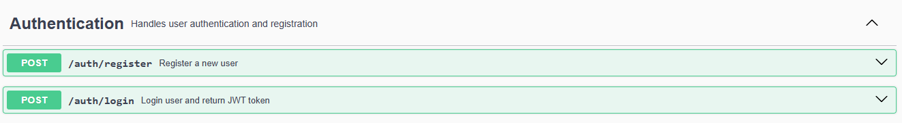
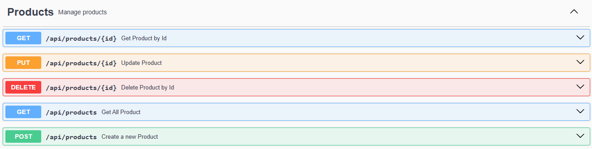
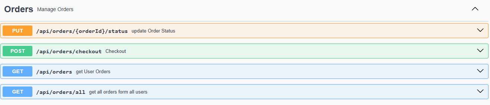
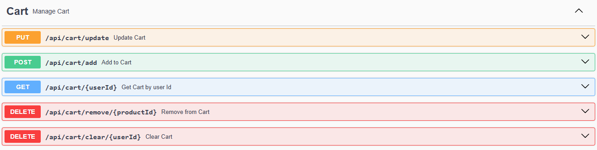

# E-Commerce API
A backend service for an online store with product, order, cart, and payment management. Built with Spring Boot, JPA, PostgreSQL, and JWT-based authentication.


## Features
<ul>
  <li>User registration, login</li>
  <li>Product management (Admin CRUD)</li>
  <li>Cart system: add, update, remove items</li>
  <li>Checkout system</li>
  <li>Order processing & status tracking</li>
  <li>Mock payment integration</li>
  <li>RESTful APIs with Swagger/OpenAPI documentation</li>
</ul>


## Tech Stack
<ul>
  <li>Java 17 / Spring Boot 3+</li>
  <li>Spring Security + JWT</li>
  <li>Spring Data JPA</li>
  <li>PostgreSQL</li>
  <li>Swagger/OpenAPI</li>
  <li>Lombok</li>
</ul>


## Project Structure
```
src/
 ├── config/
 ├── controller/
 ├── dto/
 ├── entity/
 ├── repository/
 ├── security/
 ├── service/
```


## Authentication
<ul>
  <li>JWT-based security</li>
  <li>Login returns a token</li>
  <li>Pass token in Authorization: Bearer <token> header</li>
</ul>


## Core API
### Authentication


### Products


### Orders


### Cart



### Payment


[ E-commerce Frontend using React.js ](https://github.com/soliman-sDev/ECommerce-Frontend)


